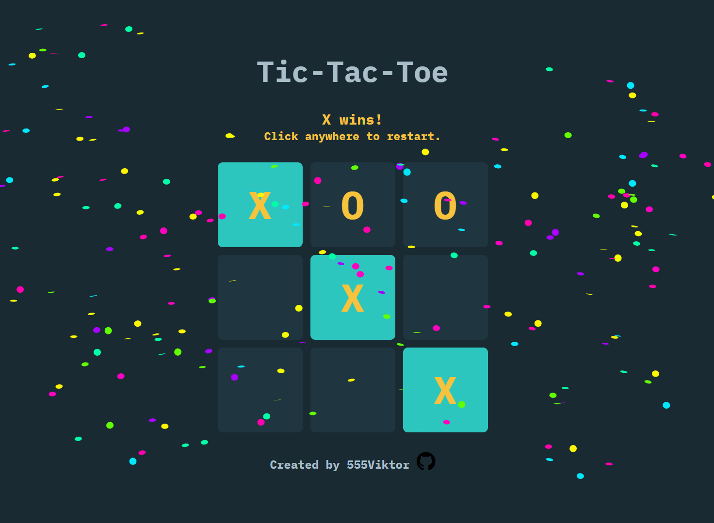

# Tic Tac Toe ⭕❌ 

[](https://555viktor.github.io/tic-tac-toe/)  

## Live Preview  
Play the game here: https://555viktor.github.io/tic-tac-toe/ or click the image above.  

## About the Project  
This **Tic Tac Toe** game is a web-based implementation of the two-player game we all know, developed with **HTML**, **CSS**, and **JavaScript**. Built as a learning exercise, this project emphasizes modular design, event-driven programming, and responsive UI techniques.  

## Features  
- **Two-Player Gameplay:** A turn-based game where Player X and Player O compete to align three symbols in a row, column, or diagonal.  
- **Win Detection:** Automatically recognizes a winning combination, highlights it, and announces the winner.  
- **Draw Handling:** Detects and declares a tie when all cells are filled without a winner.  
- **Easy Restart:** Quickly start a new game by clicking anywhere after a round ends.  
- **Responsive Design:** Optimized for seamless play on mobile, tablet, and desktop devices.  

## Technologies Used  
- **HTML** – For building the game structure.  
- **CSS** – For styling the game board and ensuring responsiveness.  
- **JavaScript** – For handling game logic, player turns, win detection, and restart functionality.
  
## How to Play  
1. **Player Turns:**  
   - Player X always begins.  
   - Click on an empty cell to place your symbol (X or O).  
   - Alternate turns until a win or draw is achieved.  

2. **Game End Conditions:**  
   - **Winning:** Form three consecutive symbols in any row, column, or diagonal. The game highlights the winning cells and announces the result.  
   - **Draw:** Fill all cells without forming a winning combination.  

3. **Restart the Game:**  
   - After the game ends, click anywhere on the screen to reset the board and start a new round.  

## Getting Started  
Want to play the game locally? Follow these steps:  

1. Clone the repository to your local machine:  
   ```bash
   git clone https://github.com/555Viktor/tic-tac-toe.git
   ```  

2. Navigate to the project folder:  
   ```bash
   cd tic-tac-toe
   ```  

3. Open the `index.html` file in your favorite browser to start playing!  

## Acknowledgements  
This project was created as part of **The Odin Project**. Special thanks to **The Odin Project** for their curriculum and resources!
